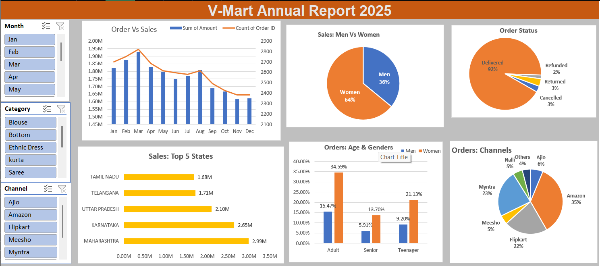

# 📊 V-Mart Store Data Analysis – Annual Report 2025  

  

## 📌 Project Overview  
This project is an **Excel-based Business Intelligence Dashboard** that analyzes the annual sales performance of **V-Mart** for the year 2025.  
It provides interactive visualizations to understand **sales trends, customer demographics, order statuses, regional performance, and sales channels**.  

---

## 🔑 Key Features  
- 📈 **Order vs Sales Trend:** Monthly comparison of total revenue and order count  
- 👥 **Customer Demographics:** Gender (Men vs Women) & Age group segmentation  
- 🚚 **Order Status:** Delivered, Returned, Cancelled, Refunded distribution  
- 🌍 **Top 5 States:** Sales contribution by Maharashtra, Karnataka, UP, etc.  
- 🛒 **Sales Channels:** Amazon, Myntra, Flipkart, Ajio, Meesho, etc.  
- 🎛 **Interactive Filters:** Month, Category, and Channel (via slicers)  

---

## 🛠️ Tools & Technologies  
- **Microsoft Excel**  
  - Pivot Tables & Charts  
  - Slicers for interactive filtering  
  - Conditional Formatting & Data Visualization  

---

## 📈 Insights from Dashboard  
- Women customers contribute **64%** of sales vs **36% men**  
- Majority of orders are **Delivered (92%)** with very low returns  
- **Maharashtra (₹2.99M)** is the top-performing state  
- **Amazon (35%)**, **Myntra (23%)**, and **Flipkart (22%)** are leading sales channels  

---

## 📂 Repository Contents  
- `V-Mart Store Data Analysis.xlsx` → Raw dataset & dashboard  
- `Screenshot.png` → Dashboard preview  

---

## 🚀 How to Use  
1. Download the Excel file from this repository  
2. Open it in Microsoft Excel (2016 or above recommended)  
3. Use slicers (Month, Category, Channel) to explore insights interactively  

---

## 📜 Conclusion  
This dashboard provides **data-driven insights** into customer behavior, regional performance, and sales channels.  
It can be used by management to design better marketing strategies and improve overall business growth.  

---
